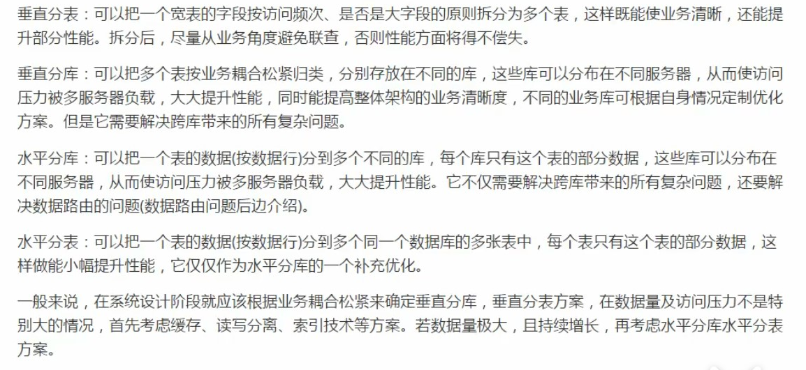

# Sharding-jdbc

> 用来对数据库分库分表的中间键

## 1. 分库分表是什么？

> 当数据库的数据量猛增，访问性能也变慢了，当我们仅提高硬件配置并不能对性能提升明显时，我们就可以把数据分散在不同的数据库中。简而言之，分库分表就是为了解决由于数据量过大而导致数据库性能降低的问题，将原来的独立的数据库拆分成若干个数据库组成，将数据大表拆分成若干数据表组成，使得单一数据库，单一数据表的数据量变小，从而达到提升数据库性能的目的；

### 1.1 分库分表的方式

#### 1.1.1 垂直分表

> 把表中一些常用的字段和不常用的字段拆分出来，从而形成两张表，三张表，甚至四张表、五张表.......
>
> 比如：当我们查询商品列表时，商品信息中有一个名为商品详情的字段，该字段为text类型，通常较大，但在我们的商品列表并不会去展示商品信息，而是当用户点击商品进入详情页面才能够看到商品的详情信息。所以避免了我们查询商品列表时，会将那些在当前页面不需要展示的字段查询出来，造成性能浪费。
>
> 定义：将一个表按照字段拆分多个表，每个表储存其中的一部分字段。

#### 1.1.2 垂直分库

> 通过垂直分表性能等到了一定程度的提升，但还是没有达到要求，并且磁盘空间也快不够用了，因为数据还是限制在一台服务器，库内垂直分表只解决了单一表数据量过大的问题，但没有将表分散到不同的数据库上，因此每个表还是竞争同一个服务器的CPU、内存、网络IO、磁盘
>
> 比如：我们有一个卖家数据库，包含着商品信息表，店铺信息表，这时候我们将商品信息表，店铺信息表拆分出来成两个数据库：
>
> 商品信息数据库，店铺信息数据库。
>
> 定义，垂直分库是指按照业务将表进行分类，分布到不同的数据库上面，每个库可以放在不同的服务器上，它的核心理念是专库专用


#### 1.1.3 水平分库

> 当垂直分库后，数据库性能得到了一定的提升，但随着业务量的增长，储存量已超出了与预期，但是业务上已经不能在垂直分库，这是即可采用水平分库。
>
> 比如：店铺信息数据库我们水平拆分成DB1,DB2,我们在进行数据的操作时，我们通过店铺的ID来划分是存储在DB1或DB2当中，比如通过判断店铺ID是双数还是单数来划分，或者除以2取余数来划分
>
> 定义：水平分库是把同一张表的数据按照一定的规则拆分到不同的数据库中，每个库可以放在不同的数据库中

#### 1.1.4 水平分表

> 在同一数据库中，将一张划分多个表table1、table2、table2，它与水平分库的思路是类似的。
>
> 定义：水平分表是在同一数据库内，把同一张表的数据按照一定的规则拆分到多个的表中。

#### 总结



## 1.2 分库分表带来的问题

### 1.2.1 事务一致性

> 由于分库分表把数据分布在不同的库，甚至不同的服务器，不可避免会带来分布式式事务的问题。

### 1.2.2 跨节点查询

> 由于数据不在同一数据库，无法进行关联查询。
>
> 这时我们可以将关联查询分为两次查询，第一次查询的结果集中找出关联数据的Id,然后根据id发起第二次请求等到相关联数据，最后将获得到数据进行拼接

### 1.2.3 跨节点分页、排序函数

> 跨节点多库进行排序查询时，limit分页，order by排序等问题，就变得复杂了。需要先在不同的分片节点中将数据进行排序并返回，然后将不同的分片返回的结果集进行汇总和再次排序

#### 1.2.4 主键避重

>在分库分表中，由于表中的数据同时存在不同的数据表中，主键值平时使用的自增长将无用武之地，某个分区数据库生成的Id无法保持全局唯一。因此需要单独的设计全局主键，以免跨库主键重复问题。

#### 1.2.4 公共表

> 实际的应用场景中，参数表、数据字典表等都是数据量较小，变动小，而且属于高频联合查询的依赖表，比如地理区域表也属于此类型。
>
> 可以将这类表在每一个数据库都保存一份，所有对公共表的更新操作都同时发送到所有分库执行。
>
> 由于分库分表之后，数据被分撒在不同的数据库、服务器中。因此，对数据的操作也无法通过常规方式完成，并且它还会带来一些列的问题。好在，这些问题不是所有都需要我们在应用层面上解决，市面上有很多中间件可供我们选择：mycat,sharding-JDBC，其中Sharding-JDBC流行度较高。
>
> Sharding-JDBC会自动将没个数据库的功能表进行增删改操作

## 2. Sharding-JDBC 介绍

> 是当当网研发的开源分布式数据库中间件，为一个轻量级的Java框架，它相当于一个增强版的JDBC驱动，完全兼容JDBC和各种ORM框架。
>
> 核心功能为：`数据分片`及`读写分离`，通过它应用可以`透明`的使用JDBC访问已经分库分表，读写分离的多个数据源，而不用关系数据源的数量如何分布的。


### 2.1 Sharding-JDBC入门demo

[官方文档](http://shardingsphere.apache.org/document/legacy/2.x/cn/02-guide/configuration/)

#### 2.1.1 创建项目，导入jar包

```xml
 		<dependency>
            <groupId>com.alibaba</groupId>
            <artifactId>druid-spring-boot-starter</artifactId>
            <version>1.1.23</version>
        </dependency>
        <dependency>
            <groupId>org.mybatis.spring.boot</groupId>
            <artifactId>mybatis-spring-boot-starter</artifactId>
            <version>2.1.3</version>
        </dependency>
        <dependency>
            <groupId>io.shardingsphere</groupId>
            <artifactId>sharding-jdbc-spring-boot-starter</artifactId>
            <version>3.1.0</version>
        </dependency>
        <dependency>
            <groupId>mysql</groupId>
            <artifactId>mysql-connector-java</artifactId>
        </dependency>
```


#### 2.1.2 编写配置文件（重点）

> properties,yml两种方式,推荐使用properties因为智能提示全

```properties
spring.application.name = sharding‐jdbc‐simple‐demo
#指springboot启动时，如果发现重名的bean就覆盖它
#因为在注册Sharding-jdbc的dataSource时，spring容易发现druid已经定义名称为dataSource的bean,并且禁用了覆盖
# 所以我们要设置为true
spring.main.allow‐bean‐definition‐overriding = true

# sharding-jdbc 分片规则

#定义数据源（有多个数据源，以逗号分隔，在配置每个数据源的配置）
# “m1”为自定义名称，需要和下面的数据源的配置对应
sharding.jdbc.datasource.names = m1

sharding.jdbc.datasource.m1.type = com.alibaba.druid.pool.DruidDataSource
sharding.jdbc.datasource.m1.driverClassName = com.mysql.cj.jdbc.Driver
sharding.jdbc.datasource.m1.url = jdbc:mysql://localhost:3306/order_db?serverTimezone=GMT&autoReconnect=true&failOverReadOnly=false&verifyServerCertificate=false
sharding.jdbc.datasource.m1.username = root
sharding.jdbc.datasource.m1.password = root

# 指定t_order表的数据分布情况，配置数据节点
#   此处的tables.t_order中的（t_order）为自定义名称，它和我们在程序中写的sql语句中的表名要对应起来，假如我们这叫abc,那么当我们写sql语句要操作该表时也应该写abc
#  （和数据库中真实名称无关，因为sharding-jdbc会帮我们处理sql语句）      该表达式表示有实际有t_order_1,t_order_2两张表，通过拼接后面的1，2来确定
sharding.jdbc.config.sharding.tables.t_order.actual-data-nodes= m1.t_order_${1..2}

#指定t_order表的主键生成策略为SNOWFLAKE （默认采用的是雪花算法，全局唯一自增的Id）
sharding.jdbc.config.sharding.tables.t_order.key-generator-column-name=order_id
#http://shardingsphere.apache.org/document/legacy/2.x/cn/02-guide/key-generator/
# **不要指定默认的算法，否则会报错**
#sharding.jdbc.config.sharding.tables.t_order.key-generator-class-name= io.shardingjdbc.core.keygen.DefaultKeyGenerator


## 指定t_order表的分片策略，分片策略包括分片键（以那个字段进行分片操作）和分片算法（通过这个算法来确定用那个表来操作该数据）
# 以order_id的值来分片
sharding.jdbc.config.sharding.tables.t_order.table-strategy.inline.sharding-column= order_id
# 通过order_id除2取余加1来确定使用那张表
sharding.jdbc.config.sharding.tables.t_order.table-strategy.inline.algorithm-expression= t_order_${order_id % 2 + 1}

# 打开sql输出日志
sharding.jdbc.config.props.sql.show = true

#mybatis的驼峰命名
mybatis.configuration.map-underscore-to-camel-case=true

logging.level.root = info
logging.level.org.springframework.web = info
logging.level.com.itheima.dbsharding = debug
logging.level.druid.sql = debug
```

```yaml
spring:
  application:
    name: sharding‐jdbc‐simple‐demo
  #指springboot启动时，如果发现重名的bean就覆盖它
  #因为在注册Sharding-jdbc的dataSource时，spring容易发现druid已经定义名称为dataSource的bean,并且禁用了覆盖
  #所以我们要设置为true
  main:
    allow-bean-definition-overriding: true

# sharding-jdbc 分片规则


sharding:
  jdbc:
    #定义数据源（有多个数据源，以逗号分隔，在配置每个数据源的配置）
    datasource:
      # “m1”为自定义名称，需要和下面的数据源的配置对应
      names: m1
      m1:
        type: com.alibaba.druid.pool.DruidDataSource
        driver-class-name: com.mysql.cj.jdbc.Driver
        url: jdbc:mysql://localhost:3306/order_db?serverTimezone=GMT&autoReconnect=true&failOverReadOnly=false&verifyServerCertificate=false
        username: root
        password: root
    config:
      sharding:
        tables:
          #指定t_order表的数据分布情况，配置数据节点
          #此处的tables.t_order中的（t_order）为自定义名称，它和我们在程序中写的sql语句中的表名要对应起来，假如我们这叫abc,那么当我们写sql语句要操作该表时也应该写abc
          #（和数据库中真实名称无关，因为sharding-jdbc会帮我们处理sql语句）该表达式表示有实际有t_order_1,t_order_2两张表，通过拼接后面的1，2来确定
          t_order:
            actualDataNodes: m1.t_order_${1..2}
            # 指定t_order表的分片策略，分片策略包括分片键（以那个字段进行分片操作）和分片算法（通过这个算法来确定用那个表来操作该数据）
            tableStrategy:
              inline:
                # 以order_id的值来分片
                shardingColumn: order_id
                # 通过order_id除2取余加1来确定使用那张表
                algorithmExpression: t_order_${order_id % 2 + 1}
            #指定t_order表的主键字段（默认采用的是SNOWFLAKE(雪花)算法，全局唯一自增的Id）
            keyGeneratorColumnName: order_id
      props:
      #是否开启SQL显示，默认值: false
        sql.show: true

mybatis:
  configuration:
    #驼峰命名
    map-underscore-to-camel-case: true

logging:
  level:
    root: info
    org:
      springframework:
        web: ERROR
    cn:
      pengan:
        simple-demo: debug
    druid:
      sql:
        debug
```


#### 2.2.3 创建dao类

```java
@Component
public interface IOrderDao {

     @Insert("INSERT INTO t_order(price,user_id,status) value(#{price},#{userId},#{status})")
    int insertOrder(@Param("price")BigDecimal price,@Param("userId") Long userId,@Param("status")String status);

    @Select("<script>" +
            "select * from t_order " +
            "where order_id in" +
            "<foreach item='id' collection='ids' separator=',' open='(' close=')'>" +
            "#{id}" +
            "</foreach>" +
            "</script>")
    List<Map> findByIds(@Param("ids")List<Long> ids);
}
```

#### 2.2.4 配置启动类

```java
@SpringBootApplication
//mybatis自动扫描（如果不加上这个，那么需要在每个Dao类上加上@Mapper注解）
@MapperScan
public class SimpleDemoApplication {

    public static void main(String[] args) {
        SpringApplication.run(SimpleDemoApplication.class, args);
    }

}
```

#### 2.2.5 测试DAO

```java
 	@Test
    void testInsertOrder() {
        for (int i = 1; i <= 30; i++) {
            orderDao.insertOrder(new BigDecimal(i),1L,"未处理");
        }
    }


    @Test
    void testFindOrderByIds() {
        List<Map> byIds = orderDao.findByIds(Arrays.asList(486556136607055872L, 486556139782144000L, 486556138700013569L));
        byIds.forEach(System.out::println);
    }
```

### 2.2 流程分析

> Sharding-JDBC在拿到用户要执行的sql之后干了那些事情

1. 解析sql,获取片键值，在上面的例子中是order_id
2. Sharding-JDBC通过规则配置t_order_${order_id % 2+1}知道了当order_id为偶数时，应该往t_order_1表中插入数据，为奇数时往t_order_2中插入数据。
3. 于是Sharding-JDBC根据order_id的值改写sql语句，改写后的SQL语句是真实所要执行的SQL语句。
4. 执行改写后的SQL语句。
5. 将所有真正执行SQL的结果进行汇总合并，返回 。

