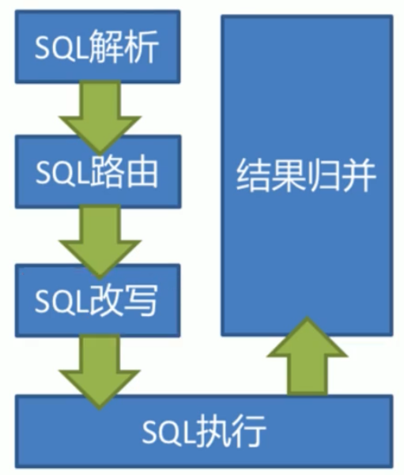

# Sharding-jdbc

> 用来对数据库分库分表的中间键

## 1. 分库分表是什么？

> 当数据库的数据量猛增，访问性能也变慢了，当我们仅提高硬件配置并不能对性能提升明显时，我们就可以把数据分散在不同的数据库中。简而言之，分库分表就是为了解决由于数据量过大而导致数据库性能降低的问题，将原来的独立的数据库拆分成若干个数据库组成，将数据大表拆分成若干数据表组成，使得单一数据库，单一数据表的数据量变小，从而达到提升数据库性能的目的；

### 1.1 分库分表的方式

#### 1.1.1 垂直分表

> 把表中一些常用的字段和不常用的字段拆分出来，从而形成两张表，三张表，甚至四张表、五张表.......
>
> 比如：当我们查询商品列表时，商品信息中有一个名为商品详情的字段，该字段为text类型，通常较大，但在我们的商品列表并不会去展示商品信息，而是当用户点击商品进入详情页面才能够看到商品的详情信息。所以避免了我们查询商品列表时，会将那些在当前页面不需要展示的字段查询出来，造成性能浪费。
>
> 定义：将一个表按照字段拆分多个表，每个表储存其中的一部分字段。

#### 1.1.2 垂直分库

> 通过垂直分表性能等到了一定程度的提升，但还是没有达到要求，并且磁盘空间也快不够用了，因为数据还是限制在一台服务器，库内垂直分表只解决了单一表数据量过大的问题，但没有将表分散到不同的数据库上，因此每个表还是竞争同一个服务器的CPU、内存、网络IO、磁盘
>
> 比如：我们有一个卖家数据库，包含着商品信息表，店铺信息表，这时候我们将商品信息表，店铺信息表拆分出来成两个数据库：
>
> 商品信息数据库，店铺信息数据库。
>
> 定义，垂直分库是指按照业务将表进行分类，分布到不同的数据库上面，每个库可以放在不同的服务器上，它的核心理念是专库专用


#### 1.1.3 水平分库

> 当垂直分库后，数据库性能得到了一定的提升，但随着业务量的增长，储存量已超出了与预期，但是业务上已经不能在垂直分库，这是即可采用水平分库。
>
> 比如：店铺信息数据库我们水平拆分成DB1,DB2,我们在进行数据的操作时，我们通过店铺的ID来划分是存储在DB1或DB2当中，比如通过判断店铺ID是双数还是单数来划分，或者除以2取余数来划分
>
> 定义：水平分库是把同一张表的数据按照一定的规则拆分到不同的数据库中，每个库可以放在不同的数据库中

#### 1.1.4 水平分表

> 在同一数据库中，将一张划分多个表table1、table2、table2，它与水平分库的思路是类似的。
>
> 定义：水平分表是在同一数据库内，把同一张表的数据按照一定的规则拆分到多个的表中。

#### 总结


### 1.2 分库分表带来的问题

#### 1.2.1 事务一致性

> 由于分库分表把数据分布在不同的库，甚至不同的服务器，不可避免会带来分布式式事务的问题。

#### 1.2.2 跨节点查询

> 由于数据不在同一数据库，无法进行关联查询。
>
> 这时我们可以将关联查询分为两次查询，第一次查询的结果集中找出关联数据的Id,然后根据id发起第二次请求等到相关联数据，最后将获得到数据进行拼接

#### 1.2.3 跨节点分页、排序函数

> 跨节点多库进行排序查询时，limit分页，order by排序等问题，就变得复杂了。需要先在不同的分片节点中将数据进行排序并返回，然后将不同的分片返回的结果集进行汇总和再次排序

#### 1.2.4 主键避重

>在分库分表中，由于表中的数据同时存在不同的数据表中，主键值平时使用的自增长将无用武之地，某个分区数据库生成的Id无法保持全局唯一。因此需要单独的设计全局主键，以免跨库主键重复问题。

#### 1.2.4 公共表

> 实际的应用场景中，参数表、数据字典表等都是数据量较小，变动小，而且属于高频联合查询的依赖表，比如地理区域表也属于此类型。
>
> 可以将这类表在每一个数据库都保存一份，所有对公共表的更新操作都同时发送到所有分库执行。
>
> 由于分库分表之后，数据被分撒在不同的数据库、服务器中。因此，对数据的操作也无法通过常规方式完成，并且它还会带来一些列的问题。好在，这些问题不是所有都需要我们在应用层面上解决，市面上有很多中间件可供我们选择：mycat,sharding-JDBC，其中Sharding-JDBC流行度较高。
>
> Sharding-JDBC会自动将没个数据库的功能表进行增删改操作

## 2. Sharding-JDBC 介绍

> 是当当网研发的开源分布式数据库中间件，为一个轻量级的Java框架，它相当于一个增强版的JDBC驱动，完全兼容JDBC和各种ORM框架。
>
> 核心功能为：`数据分片`及`读写分离`，通过它应用可以`透明`的使用JDBC访问已经分库分表，读写分离的多个数据源，而不用关系数据源的数量如何分布的。


### 2.1 Sharding-JDBC入门demo

[官方文档](http://shardingsphere.apache.org/document/legacy/2.x/cn/02-guide/configuration/)

#### 2.1.1 创建项目，导入jar包

```xml
 		<dependency>
            <groupId>com.alibaba</groupId>
            <artifactId>druid-spring-boot-starter</artifactId>
            <version>1.1.23</version>
        </dependency>
        <dependency>
            <groupId>org.mybatis.spring.boot</groupId>
            <artifactId>mybatis-spring-boot-starter</artifactId>
            <version>2.1.3</version>
        </dependency>
        <dependency>
            <groupId>io.shardingsphere</groupId>
            <artifactId>sharding-jdbc-spring-boot-starter</artifactId>
            <version>3.1.0</version>
        </dependency>
        <dependency>
            <groupId>mysql</groupId>
            <artifactId>mysql-connector-java</artifactId>
        </dependency>
```


#### 2.1.2 编写配置文件（重点）

> properties,yml两种方式,推荐使用properties因为智能提示全

```properties
spring.application.name = sharding‐jdbc‐simple‐demo
#指springboot启动时，如果发现重名的bean就覆盖它
#因为在注册Sharding-jdbc的dataSource时，spring容易发现druid已经定义名称为dataSource的bean,并且禁用了覆盖
# 所以我们要设置为true
spring.main.allow‐bean‐definition‐overriding = true

# sharding-jdbc 分片规则

#定义数据源（有多个数据源，以逗号分隔，在配置每个数据源的配置）
# “m1”为自定义名称，需要和下面的数据源的配置对应
sharding.jdbc.datasource.names = m1

sharding.jdbc.datasource.m1.type = com.alibaba.druid.pool.DruidDataSource
sharding.jdbc.datasource.m1.driverClassName = com.mysql.cj.jdbc.Driver
sharding.jdbc.datasource.m1.url = jdbc:mysql://localhost:3306/order_db?serverTimezone=GMT&autoReconnect=true&failOverReadOnly=false&verifyServerCertificate=false
sharding.jdbc.datasource.m1.username = root
sharding.jdbc.datasource.m1.password = root

# 指定t_order表的数据分布情况，配置数据节点
#   此处的tables.t_order中的（t_order）为自定义名称，它和我们在程序中写的sql语句中的表名要对应起来，假如我们这叫abc,那么当我们写sql语句要操作该表时也应该写abc
#  （和数据库中真实名称无关，因为sharding-jdbc会帮我们处理sql语句）      该表达式表示有实际有t_order_1,t_order_2两张表，通过拼接后面的1，2来确定
sharding.jdbc.config.sharding.tables.t_order.actual-data-nodes= m1.t_order_${1..2}

#指定t_order表的主键生成策略为SNOWFLAKE （默认采用的是雪花算法，全局唯一Id）
sharding.jdbc.config.sharding.tables.t_order.key-generator-column-name=order_id
#http://shardingsphere.apache.org/document/legacy/2.x/cn/02-guide/key-generator/
# **不要指定默认的算法，否则会报错**
#sharding.jdbc.config.sharding.tables.t_order.key-generator-class-name= io.shardingjdbc.core.keygen.DefaultKeyGenerator


## 指定t_order表的分片策略，分片策略包括分片键（以那个字段进行分片操作）和分片算法（通过这个算法来确定用那个表来操作该数据）
# 以order_id的值来分片
sharding.jdbc.config.sharding.tables.t_order.table-strategy.inline.sharding-column= order_id
# 通过order_id除2取余加1来确定使用那张表
sharding.jdbc.config.sharding.tables.t_order.table-strategy.inline.algorithm-expression= t_order_${order_id % 2 + 1}

# 打开sql输出日志
sharding.jdbc.config.props.sql.show = true

#mybatis的驼峰命名
mybatis.configuration.map-underscore-to-camel-case=true

logging.level.root = info
logging.level.org.springframework.web = info
logging.level.com.itheima.dbsharding = debug
logging.level.druid.sql = debug
```

```yaml
spring:
  application:
    name: sharding‐jdbc‐simple‐demo
  #指springboot启动时，如果发现重名的bean就覆盖它
  #因为在注册Sharding-jdbc的dataSource时，spring容易发现druid已经定义名称为dataSource的bean,并且禁用了覆盖
  #所以我们要设置为true
  main:
    allow-bean-definition-overriding: true

# sharding-jdbc 分片规则


sharding:
  jdbc:
    #定义数据源（有多个数据源，以逗号分隔，在配置每个数据源的配置）
    datasource:
      # “m1”为自定义名称，需要和下面的数据源的配置对应
      names: m1
      m1:
        type: com.alibaba.druid.pool.DruidDataSource
        driver-class-name: com.mysql.cj.jdbc.Driver
        url: jdbc:mysql://localhost:3306/order_db?serverTimezone=GMT&autoReconnect=true&failOverReadOnly=false&verifyServerCertificate=false
        username: root
        password: root
    config:
      sharding:
        tables:
          #指定t_order表的数据分布情况，配置数据节点
          #此处的tables.t_order中的（t_order）为自定义名称，它和我们在程序中写的sql语句中的表名要对应起来，假如我们这叫abc,那么当我们写sql语句要操作该表时也应该写abc
          #（和数据库中真实名称无关，因为sharding-jdbc会帮我们处理sql语句）该表达式表示有实际有t_order_1,t_order_2两张表，通过拼接后面的1，2来确定
          t_order:
            actualDataNodes: m1.t_order_${1..2}
            # 指定t_order表的分片策略，分片策略包括分片键（以那个字段进行分片操作）和分片算法（通过这个算法来确定用那个表来操作该数据）
            tableStrategy:
              inline:
                # 以order_id的值来分片
                shardingColumn: order_id
                # 通过order_id除2取余加1来确定使用那张表
                algorithmExpression: t_order_${order_id % 2 + 1}
            #指定t_order表的主键字段（默认采用的是SNOWFLAKE(雪花)算法，全局唯一自增的Id）
            keyGeneratorColumnName: order_id
      props:
      #是否开启SQL显示，默认值: false
        sql.show: true

mybatis:
  configuration:
    #驼峰命名
    map-underscore-to-camel-case: true

logging:
  level:
    root: info
    org:
      springframework:
        web: ERROR
    cn:
      pengan:
        simple-demo: debug
    druid:
      sql:
        debug
```


#### 2.2.3 创建dao类

```java
@Component
public interface IOrderDao {

     @Insert("INSERT INTO t_order(price,user_id,status) value(#{price},#{userId},#{status})")
    int insertOrder(@Param("price")BigDecimal price,@Param("userId") Long userId,@Param("status")String status);
	
    //当没有分片键的话，那么就会将所有相关联的表查询出来
    @Select("<script>" +
            "select * from t_order " +
            "where order_id in" +
            "<foreach item='id' collection='ids' separator=',' open='(' close=')'>" +
            "#{id}" +
            "</foreach>" +
            "</script>")
    List<Map> findByIds(@Param("ids")List<Long> ids);
}
```

#### 2.2.4 配置启动类

```java
@SpringBootApplication
//mybatis自动扫描（如果不加上这个，那么需要在每个Dao类上加上@Mapper注解）
@MapperScan
public class SimpleDemoApplication {

    public static void main(String[] args) {
        SpringApplication.run(SimpleDemoApplication.class, args);
    }

}
```

#### 2.2.5 测试DAO

```java
 	@Test
    void testInsertOrder() {
        for (int i = 1; i <= 30; i++) {
            orderDao.insertOrder(new BigDecimal(i),1L,"未处理");
        }
    }


    @Test
    void testFindOrderByIds() {
        List<Map> byIds = orderDao.findByIds(Arrays.asList(486556136607055872L, 486556139782144000L, 486556138700013569L));
        byIds.forEach(System.out::println);
    }
```

### 2.2 流程分析

> Sharding-JDBC在拿到用户要执行的sql之后干了那些事情

1. 解析sql,获取片键值，在上面的例子中是order_id
2. Sharding-JDBC通过规则配置t_order_${order_id % 2+1}知道了当order_id为偶数时，应该往t_order_1表中插入数据，为奇数时往t_order_2中插入数据。
3. 于是Sharding-JDBC根据order_id的值改写sql语句，改写后的SQL语句是真实所要执行的SQL语句。
4. 执行改写后的SQL语句。
5. 将所有真正执行SQL的结果进行汇总合并，返回 。


## 3. Sharding-JDBC执行原理

### 3.1 基本概念

* 逻辑表

  > 水平拆分的数据表的总称，例如：在上面的例子订单表分为`t_order_1`、`t_order_2`两张表，它们的逻辑表名为t_order

* 真实表

  > 在分片数据库中真实存在的物理表，及上面例子中的`t_order_1`、`t_order_2`

* 数据节点

  > 数据分片的最小物理单元。由数据源名称和数据表组成，例如：`ds_0.t_order_0`

* 绑定表

  > 指分片规则一致的主表和子表。例如：`t_order`表和`t_order_item`表，均按照`order_id`分片，绑定表之间的分区键完全相同，则次两张表互为绑定关系。绑定表之间的多表关联查询不会出现笛卡尔积关联，关联效率将大大提升

* 广播表

  > 指所有的分片数据源中都存在的表，表结构和表中的数据在每个数据库中均完全一致，使用于数据量不大且需要与海量数据的表进行关联查询的场景，例如：区域表

* 分片键

  > 用于分片的数据库字段，是将数据库（表）水平拆分的关键字段。例：将订单表中的订单主键的尾数取模分片，则订 单主键为分片字段。 SQL中如果无分片字段，将执行全路由，性能较差。 除了对单分片字段的支持，ShardingJdbc也支持根据多个字段进行分片。

* 分片算法

  > 通过分片算法将数据分片，支持通过`=`、`between`、`in`分片，分片算法需要应用方开发者自行实现，可实现的灵 活度非常高。包括：精确分片算法 、范围分片算法 ，复合分片算法 等。例如：`where order_id = ?` 将采用精确分 片算法，`where order_id in (?,?,?)`将采用精确分片算法，`where order_id BETWEEN ? and ?` 将采用范围分片算 法，复合分片算法用于分片键有多个复杂情况。

* 分片策略

  > 包含`分片键`和`分片算法`，由于分片算法的独立性，将其独立抽离。真正的可用于分片操作的是分片键+分片算法，也就是分片策略。内置的分片策略大致分为：`尾数取模`，`哈希`，`范围`，`标签`，`时间`等，由用户配置的分片策略则更加灵活，通常的使用行内表达式配置分片策略，它采用Groovy表达式表示，如`t_user_$->{u_id % 8}`t_user 表根据u_id模8，而分成8张表，表名称为 `t_user_0` 到 `t_user_7` 。

* 自增主键的生成策略

  > 通过在客户端生成自增主键替换以数据库原生自增主键的方式，做到分布式主键无重复

### 3.2 SQL解析

> 当sharding-JDBC接收到一条SQL时，会陆续执行`SQL解析 => 查询优化 => SQL路由 => SQL改写 => SQL执行 => 结果归并`，最终返回执行结果



### 3.5 SQL执行

> Sharding-JDBC采用一套自动化的执行引擎，负责将路由和改写完成之后的真实SQL安全且高效发送到底层数据源 执行。 它不是简单地将SQL通过JDBC直接发送至数据源执行；也并非直接将执行请求放入线程池去并发执行。它 更关注平衡数据源连接创建以及内存占用所产生的消耗，以及最大限度地合理利用并发等问题。 执行引擎的目标是 自动化的平衡资源控制与执行效率，他能在以下两种模式自适应切换：

**内存限制模型（追求查询速度，怎么快怎么来）OLAP**

> 使用此模式的前提是，Sharding-JDBC对一次操作所耗费的数据库连接数量不做限制。 如果实际执行的SQL需要对 某数据库实例中的200张表做操作，则对每张表创建一个新的数据库连接，并通过多线程的方式并发处理，以达成 执行效率最大化。

**连接限制模式（保证事务性，对数据的增删改操作）OLTP**

> 使用此模式的前提是，Sharding-JDBC严格控制对一次操作所耗费的数据库连接数量。 如果实际执行的SQL需要对 某数据库实例中的200张表做操作，那么只会创建唯一的数据库连接，并对其200张表串行处理。 如果一次操作中 的分片散落在不同的数据库，仍然采用多线程处理对不同库的操作，但每个库的每次操作仍然只创建一个唯一的数 据库连接。

*差异*

> 内存限制模式适用于OLAP操作，可以通过放宽对数据库连接的限制提升系统吞吐量； 连接限制模式适用于OLTP操 作，OLTP通常带有分片键，会路由到单一的分片，因此严格控制数据库连接，以保证在线系统数据库资源能够被 更多的应用所使用，是明智的选择。

## 4. 分库分表、垂直分库、公共表配置示例

```properties

# sharding-jdbc 分片规则，该配置文件只进行了一个数据库水平分表的配置

#定义数据源（有多个数据源，以逗号分隔，在配置每个数据源的配置）
# “m1”为自定义名称，需要和下面的数据源的配置对应
sharding.jdbc.datasource.names = m0,m1,m2

# 将user表拆分出来，垂直分库
sharding.jdbc.datasource.m0.type = com.alibaba.druid.pool.DruidDataSource
sharding.jdbc.datasource.m0.driverClassName = com.mysql.cj.jdbc.Driver
sharding.jdbc.datasource.m0.url = jdbc:mysql://localhost:3306/user_db?serverTimezone=GMT&autoReconnect=true&failOverReadOnly=false&verifyServerCertificate=false
sharding.jdbc.datasource.m0.username = root
sharding.jdbc.datasource.m0.password = root

sharding.jdbc.datasource.m1.type = com.alibaba.druid.pool.DruidDataSource
sharding.jdbc.datasource.m1.driverClassName = com.mysql.cj.jdbc.Driver
sharding.jdbc.datasource.m1.url = jdbc:mysql://localhost:3306/order_db_1?serverTimezone=GMT&autoReconnect=true&failOverReadOnly=false&verifyServerCertificate=false
sharding.jdbc.datasource.m1.username = root
sharding.jdbc.datasource.m1.password = root

sharding.jdbc.datasource.m2.type = com.alibaba.druid.pool.DruidDataSource
sharding.jdbc.datasource.m2.driverClassName = com.mysql.cj.jdbc.Driver
sharding.jdbc.datasource.m2.url = jdbc:mysql://localhost:3306/order_db_2?serverTimezone=GMT&autoReconnect=true&failOverReadOnly=false&verifyServerCertificate=false
sharding.jdbc.datasource.m2.username = root
sharding.jdbc.datasource.m2.password = root

#配置公共表，在m0,m1,m2数据源中都有一张t_dict,它作为这几个库的公共表
sharding.jdbc.config.sharding.broadcast-tables = t_dict

# 指定数据节点，因为user库是从user拆分出来，只有一个库及表，所以我们不用配置它的分片策略
sharding.jdbc.config.sharding.tables.t_user.actual-data-nodes=m0.t_user
sharding.jdbc.config.sharding.tables.t_user.key-generator-column-name=user_id

# 指定t_order表的数据分布情况，配置数据节点
#   此处的tables.t_order中的（t_order）为自定义名称，它和我们在程序中写的sql语句中的表名要对应起来，假如我们这叫abc,那么当我们写sql语句要操作该表时也应该写abc
#  （和数据库中真实名称无关，因为sharding-jdbc会帮我们处理sql语句）      该表达式表示有实际有t_order_1,t_order_2两张表，通过拼接后面的1，2来确定
sharding.jdbc.config.sharding.tables.t_order.actual-data-nodes= m$->{1..2}.t_order_$->{1..2}


#指定t_order表的主键生成策略为SNOWFLAKE （默认采用的是雪花算法，全局唯一自增的Id）
sharding.jdbc.config.sharding.tables.t_order.key-generator-column-name=order_id
#http://shardingsphere.apache.org/document/legacy/2.x/cn/02-guide/key-generator/
# **不要指定默认的算法，否则会报错**
#sharding.jdbc.config.sharding.tables.t_order.key-generator-class-name= io.shardingjdbc.core.keygen.DefaultKeyGenerator

## 指定t_order表的分库策略,这里使用user_id作为分片键
sharding.jdbc.config.sharding.tables.t_order.database-strategy.inline.sharding-column= user_id
sharding.jdbc.config.sharding.tables.t_order.database-strategy.inline.algorithm-expression= m$->{user_id % 2 + 1}

## 指定t_order表的分片策略，分片策略包括分片键（以那个字段进行分片操作）和分片算法（通过这个算法来确定用那个表来操作该数据）
# 以order_id的值来分片
sharding.jdbc.config.sharding.tables.t_order.table-strategy.inline.sharding-column= order_id
# 通过order_id除2取余加1来确定使用那张表
sharding.jdbc.config.sharding.tables.t_order.table-strategy.inline.algorithm-expression= t_order_$->{order_id % 2 + 1}

```

## 5. 主从同步

> Sharding-JDBC提供一主多从的读写分离配置，并不提供数据同步功能，我们需要自己配置mysql的主从库之间的同步功能

### 5.1 Docker安装MySQL主从库配置

#### 5.1.1 master库的my.ini配置文件配置

```cnf
# 创建本地创建 /mysql-master/my.cnf 文件夹

[mysql]
default-character-set=utf8

[mysqld]

user=mysql
character-set-server=utf8
max_allowed_packet=128M

#给数据库服务的唯一标识
server-id=3306
#开启二进制文件，后面的设置的master-bin就是二进制文件名字的前缀
log-bin=master-bin
#开启二进制文件的索引
log-bin-index=master-bin.index

#设置需要同步的数据库
replicate_wild_do_table=user_db.%
#屏蔽系统库同步
replicate_wild_ignore_table=mysql.%
replicate_wild_ignore_table=information_schema.%
replicate_wild_ignore_table=performance_schema.%

```

#### 5.1.2 slave库的my.ini配置文件配置

```cnf
# 创建本地创建 /mysql-slave/my.cnf 文件夹

[mysql]
default-character-set=utf8

[mysqld]

character-set-server=utf8

server-id=3308


## 开启二进制日志功能，以备Slave作为其它Slave的Master时使用
log-bin=mysql-slave-bin

relay-log=slave-relay-bin

relay-log-index=slave-relay-bin.index

#设置需要同步的数据库
replicate_wild_do_table=user_db.%
#屏蔽系统库同步
replicate_wild_ignore_table=mysql.%
replicate_wild_ignore_table=information_schema.%
replicate_wild_ignore_table=performance_schema.%

```

#### 5.1.3 执行docker命令

```powershell
 # -v 参数为上面创建的配置文件路径
 
 docker run -d -p 3308:3306 --restart always --privileged=true -e MYSQL_USER="root" -e MYSQL_PASSWORD="root" -e MYSQL_ROOT_PASSWORD="root" --name mysql-slave -v /e/my-slave/my.cnf:/etc/mysql/my.cnf  mysql:5.7
 
  docker run -d -p 3306:3306 --restart always --privileged=true -e MYSQL_USER="root" -e MYSQL_PASSWORD="root" -e MYSQL_ROOT_PASSWORD="root"  --name mysql-master -v /e/my-master/my.cnf:/etc/mysql/my.cnf  mysql:5.7

```

#### 5.1.4 在Slave数据库中配置

```sql
# master_log_file和master_log_pos是在master数据库中使用show master status;查询到的数据
# mater_host 需要通过 docker inspect --format='{{.NetworkSettings.IPAddress}}' 容器名称|容器id 查看master 的ip来填写
change master to master_host='172.17.0.2', master_port=3306, master_user='root',master_password='root', master_log_file='master-bin.000003',master_log_pos=154;


# 其它的管理 主从数据的命令

## slave
	start slave
	
	show slave status;
	
	stop slave;
	
	#设置跳过一步错误
	set global sql_slave_skip_counter =1; 
	
	#清除slave上的同步位置，删除所有旧的同步日志，使用新的日志重新开始.(使用前先停止slave服务）
	
	reset slave;
	
## master
                                          
	show master status;
	
	# 重置master log,重置之后要在slave库中也重新执行 change master
	reset master;
	
	#查看当前数据的server_id
	show variables like 'server_id';
```

### 5.2 Sharding-JDBC的配置

```properties
sharding.jdbc.datasource.names = m0,s0

# 将user表拆分出来，垂直分库
sharding.jdbc.datasource.m0.type = com.alibaba.druid.pool.DruidDataSource
sharding.jdbc.datasource.m0.driverClassName = com.mysql.cj.jdbc.Driver
sharding.jdbc.datasource.m0.url = jdbc:mysql://localhost:3306/user_db?serverTimezone=GMT&autoReconnect=true&failOverReadOnly=false&verifyServerCertificate=false
sharding.jdbc.datasource.m0.username = root
sharding.jdbc.datasource.m0.password = root

# 主从库，m0为主，s0为从数据库
sharding.jdbc.datasource.s0.type = com.alibaba.druid.pool.DruidDataSource
sharding.jdbc.datasource.s0.driverClassName = com.mysql.cj.jdbc.Driver
sharding.jdbc.datasource.s0.url = jdbc:mysql://localhost:3308/user_db?serverTimezone=GMT&autoReconnect=true&failOverReadOnly=false&verifyServerCertificate=false
sharding.jdbc.datasource.s0.username = root
sharding.jdbc.datasource.s0.password = root

### m0，s0的主从库配置
sharding.jdbc.config.sharding.master-slave-rules.ds0.master-data-source-name = m0
## 如果有多个从库数据源，用逗号分隔
sharding.jdbc.config.sharding.master-slave-rules.ds0.slave-data-source-names = s0
### 负载均衡算法
sharding.jdbc.config.sharding.master-slave-rules.ds0.load-balance-algorithm-type = round_robin


# 垂直分库配置
# 指定数据节点，因为User库是从user表过来的，只有一个库及表，所以我们不用写表达式，其它的分片策略也不需要配置
        ## 因为配置了user库的主从库同步，所以这里要配置成主从的名称（本来这里是m0.t_user）
sharding.jdbc.config.sharding.tables.t_user.actual-data-nodes=ds0.t_user
sharding.jdbc.config.sharding.tables.t_user.key-generator-column-name=user_id
```

## 6 总结

> 为什么分库分表？分库分表就是为了解决由于数据量过大而导致数据库性能降低的问题，将原来独立的数据库拆分 成若干数据库组成 ，将数据大表拆分成若干数据表组成，使得单一数据库、单一数据表的数据量变小，从而达到提 升数据库性能的目的。

### 6.1 分库分表方式

* 垂直分库
* 垂直分表
* 水平分库
* 水平分表

### 6.2 分库分表带来的问题

> 由于数据分散在多个数据库，服务器导致了事务一致性问题、跨节点join问题、跨节点分页、 排序、函数，主键需要全局唯一，公共表

### 6.3 最佳实践

> 系统在设计之初就应该对业务数据的耦合松紧进行考量，从而进行垂直分库、垂直分表，使数据层架构清晰明了。 若非必要，无需进行水平切分，应先从缓存技术着手降低对数据库的访问压力。如果缓存使用过后，数据库访问量 还是非常大，可以考虑数据库读、写分离原则。若当前数据库压力依然大，且业务数据持续增长无法估量，最后可 考虑水平分库、分表，单表拆分数据控制在1000万以内。

#### 6.3.1 不支持的SQL语句

* `INSERT INTO tbl_name (col1, col2, …) VALUES(1+2, ?, …)` ——VALUES语句不支持运算 表达式
* `INSERT INTO tbl_name (col1, col2, …) SELECT col1, col2, … FROM tbl_name WHERE col3 = ?` ——INSERT .. SELECT
* `SELECT COUNT(col1) as count_alias FROM tbl_name GROUP BY col1 HAVING count_alias > ?`——HAVING
* `SELECT * FROM tbl_name1 UNION SELECT * FROM tbl_name2 ` ——UNION
* `SELECT * FROM tbl_name1 UNION ALL SELECT * FROM tbl_name2`——UNION ALL
* `SELECT * FROM ds.tbl_name1 ` ——包含schema
* `SELECT SUM(DISTINCT col1), SUM(col1) FROM tbl_name` ——DISTINCT 

### 6.4 事务

> sharding-jdbc支持三种事务

* 本地事务

> 在不开启任何分布式事务管理器的前提下，让每个数据节点各自管理自己的事务。 它们之间没有协调以及通信的能力，也并不互相知晓其他数据节点事务的成功与否。 本地事务在性能方面无任何损耗，但在强一致性以及最终一致性方面则力不从心。

* 两阶段提交事务（XA协议）
* 柔性事务（BASE事务）

https://shardingsphere.apache.org/document/current/cn/features/transaction/